# Conceptual Data Lineage Design

## Overview

This document maps data lineage across the full streaming-to-read-model pipeline
already demonstrated in this portfolio:

```
mini-lakehouse-kafka  →  (transformation layers)  →  mongo-nosql-poc
   [Kafka Topic]             [Spark / Bronze / Silver]      [Read Model]
```

Lineage answers a deceptively simple question:

> **"Where did this value come from, and what happened to it on the way?"**

This design focuses on **explainability** — not on specific tooling.
The goal is to reason clearly about data flow, transformation ownership,
and trust boundaries between pipeline stages.

---

## The Pipeline in Scope

```
[Source System]
      │
      ▼
[Kafka Topic]          ← event published: orders.created
      │
      ▼
[Spark Streaming]      ← reads topic, applies transformations
      │
      ▼
[Bronze Table]         ← raw, schema-on-write, append-only
      │
      ▼
[Silver Table]         ← cleaned, deduplicated, enriched
      │
      ▼
[Gold / Read Model]    ← aggregated, query-optimized, consumer-facing
```

Each arrow is a **lineage edge** — a traceable relationship between a data asset
and its upstream origin.

---

## Lineage Diagram

```mermaid
flowchart TD
    SRC["🏢 Source System\n(e.g. Order Service)"]
    TOPIC["📨 Kafka Topic\norders.created\n─────────────\nevent_id, customer_id,\nproduct_id, quantity,\nprice_gross, timestamp"]

    SPARK["⚙️ Spark Streaming Job\norders_transformer\n─────────────\nReads: orders.created\nWrites: bronze.orders_raw"]

    BRONZE["🗄️ Bronze Table\nbronze.orders_raw\n─────────────\nevent_id, customer_id,\nproduct_id, quantity,\nprice_gross, ingested_at,\nkafka_offset, partition"]

    SILVER["🗄️ Silver Table\nsilver.orders_enriched\n─────────────\norder_id, customer_id,\nproduct_id, quantity,\nprice_net [derived],\ncurrency [looked up],\nprocessed_at"]

    GOLD["🗄️ Gold Table\ngold.daily_order_summary\n─────────────\ndate, customer_id,\ntotal_orders [agg],\ntotal_revenue_net [agg],\nupdated_at"]

    READ["📖 Read Model\ncustomer_order_profile\n(MongoDB / Redis)\n─────────────\ncustomer_id,\nlifetime_revenue,\nlast_order_date,\norder_count"]

    SRC -->|"publishes event"| TOPIC
    TOPIC -->|"stream consumed\n[dataset-level]"| SPARK
    SPARK -->|"lands raw event\n[dataset-level]"| BRONZE
    BRONZE -->|"price_gross → price_net\ntax_rate lookup\n[column-level]"| SILVER
    SILVER -->|"GROUP BY date, customer\nSUM(price_net)\n[column-level]"| GOLD
    GOLD -->|"projection / materialization\n[dataset-level]"| READ

    style SRC fill:#f0f0f0,stroke:#999
    style TOPIC fill:#fff3cd,stroke:#e6ac00
    style SPARK fill:#d4edda,stroke:#28a745
    style BRONZE fill:#cce5ff,stroke:#004085
    style SILVER fill:#cce5ff,stroke:#004085
    style GOLD fill:#d1ecf1,stroke:#0c5460
    style READ fill:#f8d7da,stroke:#721c24
```



---

## Column-Level vs Dataset-Level Lineage

These are not competing approaches — they operate at different layers of granularity
and serve different needs.

### Dataset-Level Lineage

Tracks which **tables or topics** are the source for which other **tables or topics**.

**Example:**
> `bronze.orders_raw` → `silver.orders_enriched`

**What it answers:**
- Which upstream dataset was affected if `orders.created` schema changes?
- Which downstream tables are impacted if we drop `bronze.orders_raw`?
- What is the full dependency chain from Kafka to Read Model?

**When it's enough:**
Dataset-level lineage is sufficient for impact analysis, pipeline ownership, and
data discovery. It is the baseline for any lineage implementation.

**Limitation:**
It cannot explain *why* a value in a column is wrong, or *which transformation*
produced a specific derived field.

---

### Column-Level Lineage

Tracks which **specific field** in an upstream asset produced which **field** in
a downstream asset — including derived and transformed fields.

**Examples from this pipeline:**

| Source Column | Transformation | Target Column | Stage |
|---|---|---|---|
| `price_gross` | `× (1 - tax_rate)` | `price_net` | Bronze → Silver |
| `timestamp` | `DATE_TRUNC('day', ...)` | `date` | Silver → Gold |
| `price_net` | `SUM(...)` | `total_revenue_net` | Silver → Gold |
| `total_revenue_net` | `accumulated over time` | `lifetime_revenue` | Gold → Read Model |
| `event_id` | `passed through` | `order_id` | Kafka → Bronze |

**What it answers:**
- Why does a customer's `lifetime_revenue` look wrong?
- Which source field feeds the revenue KPI on the dashboard?
- Is the `price_net` in Gold derived from gross including or excluding VAT?

**When it's necessary:**
Column-level lineage becomes essential for debugging data quality issues, auditing
regulatory calculations (e.g., financial reporting), and explaining ML feature origins.

---

## Lineage Trust Boundaries

Not all pipeline stages have equal trustworthiness. Lineage must be interpreted
in the context of which layer introduced the data:

```
┌─────────────────────────────────────────────────────────┐
│  TRUST LAYER       │ WHAT IT GUARANTEES                 │
├─────────────────────────────────────────────────────────┤
│  Kafka Topic       │ Event happened — not that it's     │
│                    │ correct or deduplicated             │
├─────────────────────────────────────────────────────────┤
│  Bronze Table      │ Exactly what arrived from Kafka,   │
│                    │ schema-enforced, not yet cleaned    │
├─────────────────────────────────────────────────────────┤
│  Silver Table      │ Deduplicated, enriched, validated  │
│                    │ — source of truth for entities     │
├─────────────────────────────────────────────────────────┤
│  Gold Table        │ Aggregated for a specific use case │
│                    │ — not general purpose              │
├─────────────────────────────────────────────────────────┤
│  Read Model        │ Optimized for reads — may be       │
│                    │ eventually consistent              │
└─────────────────────────────────────────────────────────┘
```

A lineage trace that stops at "it came from the Read Model" is incomplete —
the question is always: which Silver field, from which Bronze event, from which
Kafka offset?

---

## Connection to Portfolio Projects

This lineage model explicitly bridges the two existing implementations:

### From mini-lakehouse-kafka
The Kafka → Bronze → Silver pipeline defines the **upstream lineage chain**.
The Bronze layer is the lineage anchor: it preserves `kafka_offset` and `partition`
alongside the business fields, making it possible to trace any Silver or Gold
value back to a specific event in the topic.

### From mongo-nosql-poc
The MongoDB Read Model is the **terminal lineage node** — a materialized
projection built from Gold aggregates. The CQRS pattern means:
- The **write side** (event store) is the lineage source of truth
- The **read side** (Read Model) is a derived, queryable artifact

Lineage here must acknowledge that the Read Model can be **rebuilt** from the
event store — which is itself a form of lineage verification.

---

## Limitations of This Design

These are documented intentionally — lineage is hard, and honesty about the
limitations is part of architectural maturity.

### 1. Lineage Breaks at Manual Transformations
Any ad-hoc SQL, notebook, or script that transforms data outside the defined
pipeline creates an **invisible lineage gap**. Without catalog integration or
transformation metadata, the relationship is undocumented.

### 2. Column-Level Lineage Requires Tooling to Scale
Manually documenting column mappings (as in the table above) is feasible for
small pipelines. At scale — dozens of tables, hundreds of columns — this becomes
unmaintainable without a dedicated lineage tool (e.g. OpenLineage, DataHub, Marquez).

### 3. Streaming Offsets Are Not Business Keys
Kafka `offset` + `partition` identifies a message technically, but they are
not stable business identifiers. A compacted topic or retention policy can
remove older offsets, breaking backward lineage traces.

### 4. Derived Columns May Have Multiple Parents
`price_net` is derived from both `price_gross` (Bronze) and `tax_rate`
(a lookup table, potentially static config). Column-level lineage for multi-source
derivations is non-trivial to represent and requires explicit documentation
of the lookup join's provenance.

### 5. Read Model Staleness Is Not Lineage
If the Read Model is eventually consistent, a consumer reading `lifetime_revenue`
is reading a snapshot — not necessarily current. This is a **freshness** problem,
not a lineage problem, but the two are often confused. Lineage tells you *where*
data came from; it does not tell you *when* it was last updated.

### 6. Schema Evolution Is a Lineage Risk
If `orders.created` adds a new field or renames `price_gross` to `amount_gross`,
all downstream column-level lineage mappings break silently unless schema
versioning is explicitly tracked (e.g., via Schema Registry + version-aware lineage).

---

## Summary

| Lineage Type | Granularity | Best For | Requires |
|---|---|---|---|
| Dataset-level | Table / Topic | Impact analysis, discovery | Documentation, catalog |
| Column-level | Field / Derivation | Debugging, auditing, compliance | Schema tracking, tooling |

The right starting point for any data platform is **dataset-level lineage first**,
applied consistently. Column-level lineage should be introduced selectively —
starting with the fields that matter most for business decisions or regulatory compliance.
